# Cook & Craft App - Sitemap

This document contains a comprehensive sitemap of all screens in the Cook & Craft app. Add screenshots by replacing the placeholder image paths.

---

## 1. Authentication Flow

### 1.1 Splash Screen
- **Route:** `/`
- **How to Access:** Automatically shown when app launches
- **Screenshot:** 

### 1.2 Onboarding Screen
- **Route:** `/onBoarding`
- **How to Access:** Shown after splash screen for first-time users
- **Screenshot:** 

### 1.3 Login Screen
- **Route:** `/login`
- **How to Access:** Tap "Sign In" button from splash/onboarding, or navigate from any screen requiring authentication
- **Screenshot:** 
### 1.3 Gust Mode
- **Route:** `/login`
- **How to Access:** Tap "continue as guest" requiring authentication
- **Screenshot:** 

### 1.4 Sign Up Form
- **Route:** `/signUpForm`
- **How to Access:** Tap "Sign Up" or "Create Account" button from login screen
- **Screenshot:** 
- **Screenshot:** 


### 1.7 Email Verification
- **Route:** `/emailVerification`
- **How to Access:** Automatically navigated after signup or when requesting password reset via email
- **Screenshot:** 

### 1.8 Phone Verification
- **Route:** `/phoneVerification`
- **How to Access:** Automatically navigated after signup or when requesting password reset via phone
- **Screenshot:** 

### 1.9 Forgot Password
- **Route:** `/forgotPassword`
- **How to Access:** Tap "Forgot Password?" link on login screen
- **Screenshot:** 
- **Screenshot:** 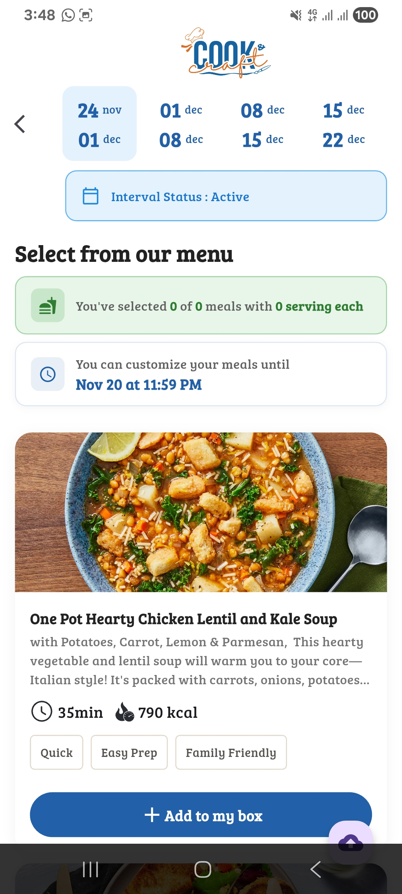
- **Screenshot:** 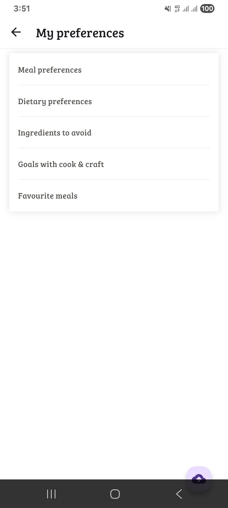


## 2. Main Navigation (Tabs Screen)

### 2.1 Tabs Screen Container
#### 2.1.1 Schedule Tab
- **Screen:** Change Meal Screen
- **How to Access:** Tap the "Schedule" tab (first tab) in bottom navigation bar
- **Screenshot:** 
- **Screenshot:** 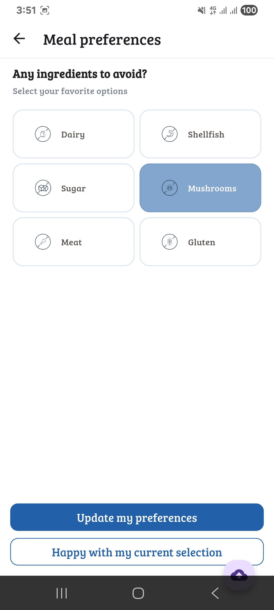
- **Screenshot:** 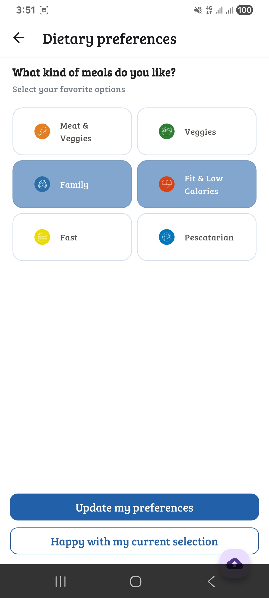

#### 2.1.2 Explore Tab
- **Screen:** Explore Screen
- **How to Access:** Tap the "Explore" tab (second tab) in bottom navigation bar
- **Screenshot:** 
- **Screenshot:** 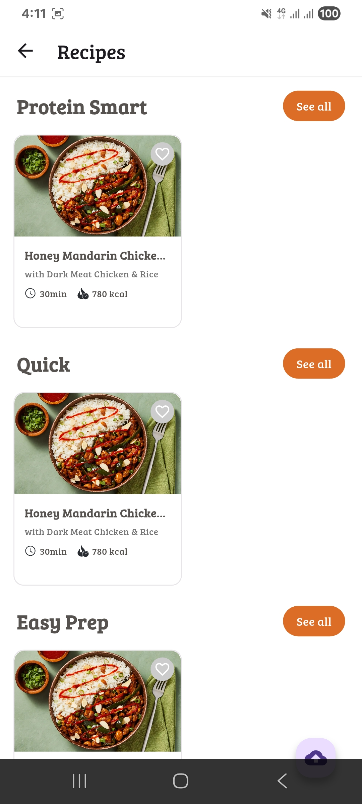
- **Screenshot:** 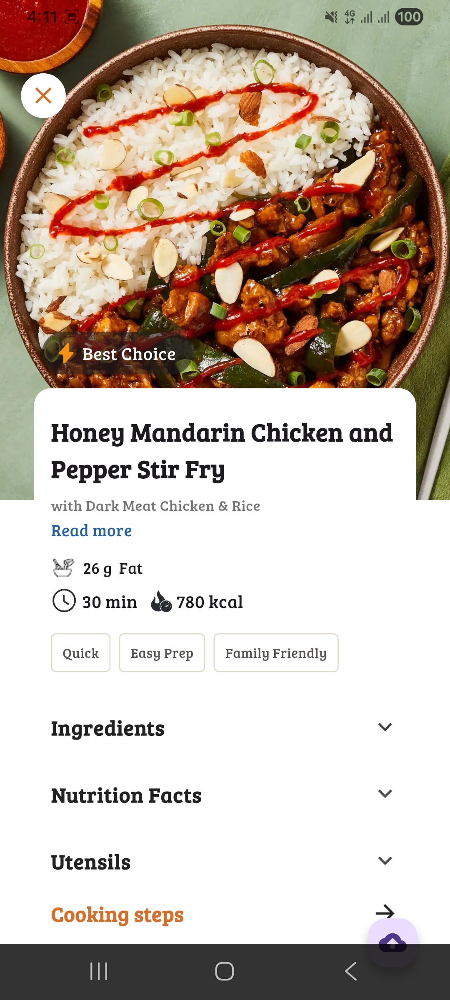
- **Screenshot:** 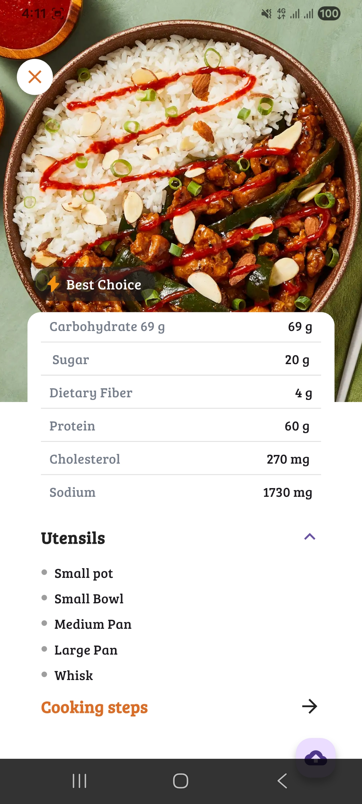
- **Screenshot:** 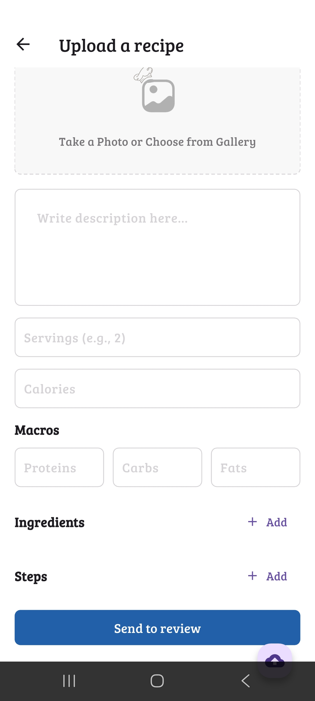
- **Screenshot:** 
- **Screenshot:** 
- **Screenshot:** 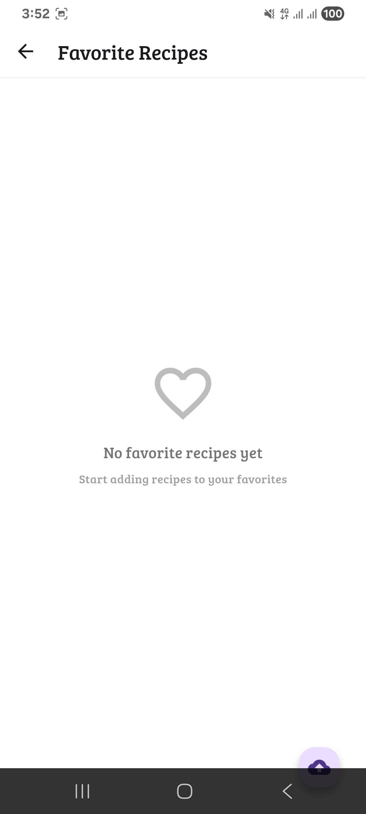

#### 2.1.3 Market Tab
- **Screen:** Market Screen
- **How to Access:** Tap the "Market" tab (third tab) in bottom navigation bar
- **Screenshot:** 
- **Screenshot:** 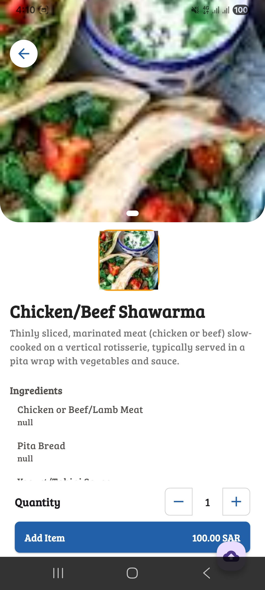
- **Screenshot:** 
- **Screenshot:** 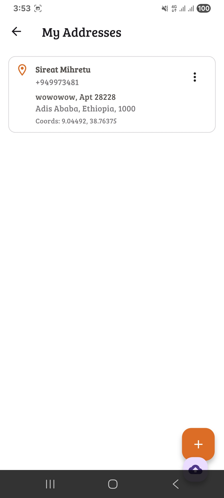

#### 2.1.4 Community Tab
- **Screen:** Community Screen
- **How to Access:** Tap the "Community" tab (fourth tab) in bottom navigation bar
- **Screenshot:** 
- **Screenshot:** 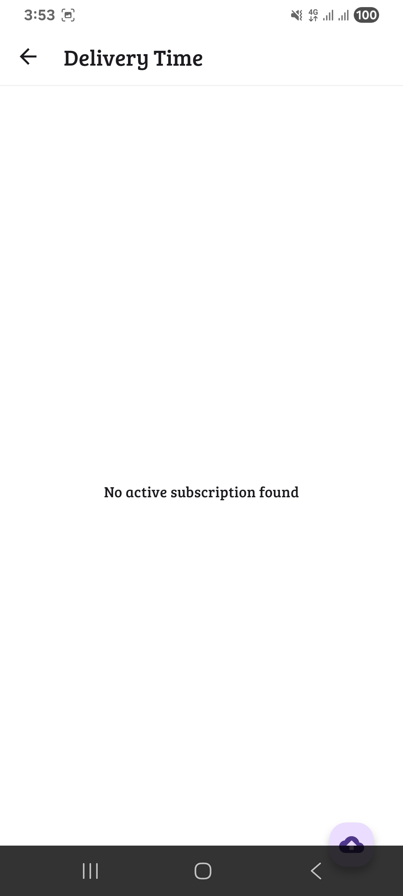

#### 2.1.5 Profile Tab
- **Screen:** Profile Screen
- **How to Access:** Tap the "Profile" tab (fifth tab) in bottom navigation bar
- **Screenshot:** 
- **Screenshot:** 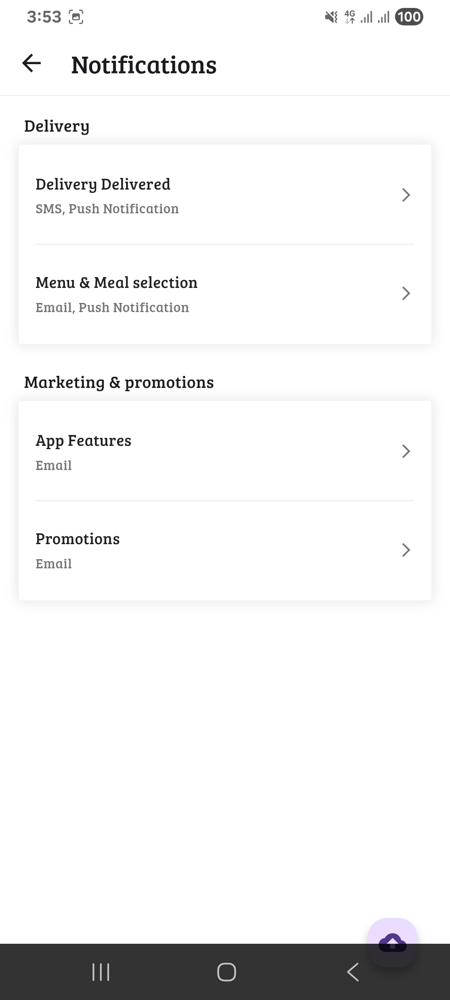

---

## 3. Schedule & Meal Plan


### 3.2 Meal Selection
- **Route:** `/mealSelection`
- **How to Access:** Navigate from Meal Plan Form or Schedule screen when selecting meals
- **Screenshot:** 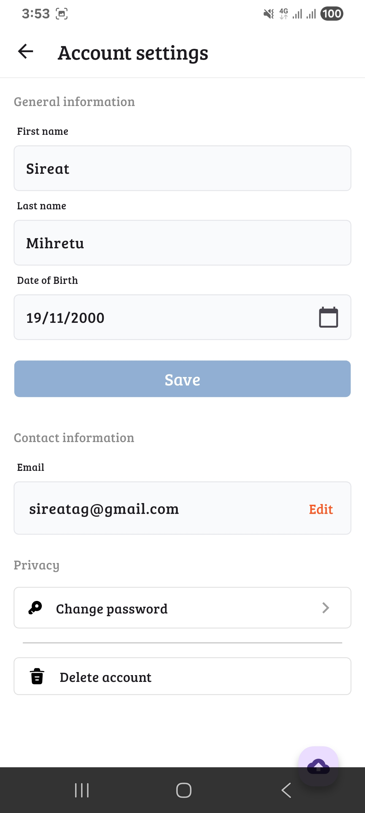


### 3.6 Week Menu
- **Route:** `/weekMenu`
- **How to Access:** Tap "Week Menu" or "View Week" button from Schedule screen
- **Screenshot:** 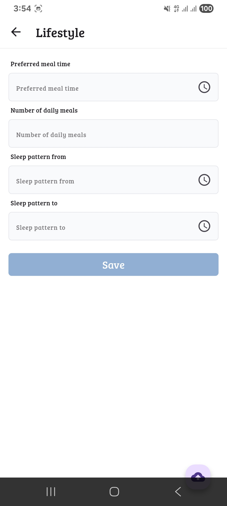

### 3.7 Past Orders
- **Route:** `/pastOrders`
- **How to Access:** Navigate from Market screen or Profile → Orders History
- **Screenshot:** 

### 3.8 Meal Preferences
- **Route:** `/mealPreferences`
- **How to Access:** Navigate from Profile → Settings → Meal Preferences

### 3.9 Resume Subscription Checkout
- **Route:** `/resumeSubscriptionCheckout`
- **How to Access:** Navigate from Profile → Meals Plan Subscription Menu → Resume Subscription

### 3.10 All Subscription Interval
- **Route:** `/allSubscriptionIntervallRoute`
- **How to Access:** Navigate from Profile → Meals Plan Subscription Menu → View All Intervals

---

## 4. Shop & Market

### 4.1 Market Box Details
- **Route:** `/marketBoxDetails`
- **How to Access:** Tap on any product/box from Market screen
- **Screenshot:** 
- **Screenshot:** 

### 4.2 Explore Our Box
- **Route:** `/exploreOurBoxScreen`
- **How to Access:** Tap "Explore Our Box" button from Explore screen or Market screen

### 4.3 Cart Orders
- **Route:** `/shoppingCard`
- **How to Access:** Tap shopping cart icon from Market screen or any product detail screen
- **Screenshot:** 

### 4.4 Addons
- **Route:** `/addons`
- **How to Access:** Navigate from Cart Orders screen → Add Addons, or from checkout flow

### 4.5 Order Summary
- **Route:** `/orderSummary`
- **How to Access:** Navigate from Cart Orders screen → Proceed to Checkout → Order Summary
- **Screenshot:** 

---

## 5. Community

### 5.1 Recipes Screen
- **Route:** `/recipes`
- **How to Access:** Navigate from Community tab → Recipes section, or tap "Recipes" from Community screen
- **Screenshot:** 

### 5.2 Recipe Details
- **Route:** `/recipeDetailsRoute`
- **How to Access:** Tap on any recipe card from Recipes screen
- **Screenshot:** 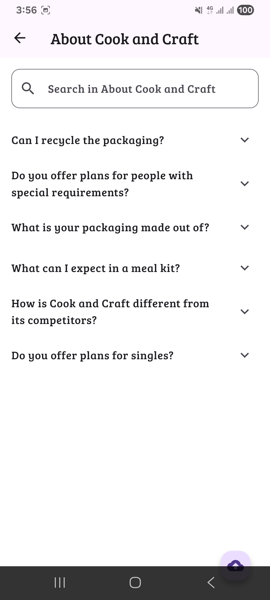
- **Screenshot:** 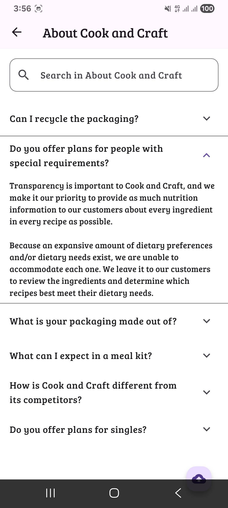

### 5.3 Recipe Steps
- **Route:** `/recipeStepsRoute`
- **How to Access:** Tap "View Steps" or "Start Cooking" button from Recipe Details screen

### 5.4 Recipes By Tags
- **Route:** `/recipesByTags`
- **How to Access:** Tap on any recipe tag/category from Recipes screen

### 5.5 Submit Recipe
- **Route:** `/submitRecipe`
- **How to Access:** Navigate from Community tab → Recipes → "Submit Recipe" button

### 5.6 Posts Screen
- **Route:** `/posts`
- **How to Access:** Navigate from Community tab → Posts section, or tap "Posts" from Community screen
- **Screenshot:** 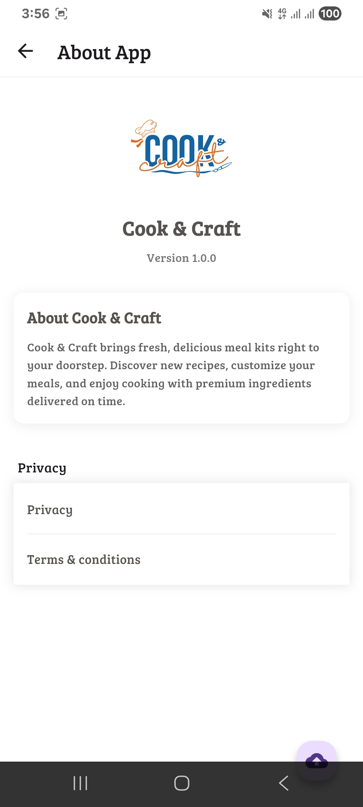

### 5.7 Create Post
- **Route:** `/createPost`
- **How to Access:** Tap floating action button (+) from Posts screen

### 5.8 Polls
- **Route:** `/polls`
- **How to Access:** Navigate from Community tab → Polls section, or tap "Polls" from Community screen

### 5.9 Announcements
- **Route:** `/announcements`
- **How to Access:** Navigate from Community tab → Announcements section, or tap notification/bell icon

---

## 6. Profile & Settings

### 6.1 Profile Screen (Main Tab)
- **Route:** `/tabs` (Profile Tab)
- **How to Access:** Tap the "Profile" tab (fifth tab) in bottom navigation bar
- **Screenshot:** 
- **Screenshot:** 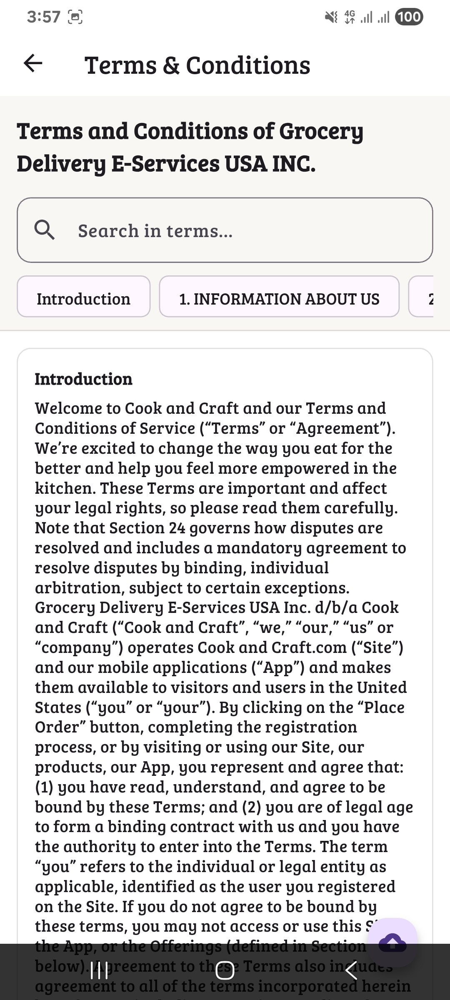

### 6.2 Wallets
- **Route:** `/wallets`
- **How to Access:** Navigate from Profile → Wallets section, or tap wallet icon/balance
- **Screenshot:** 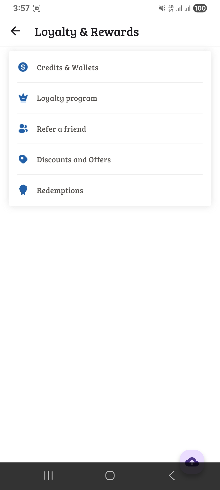

### 6.3 Store Rewards
- **Route:** `/storeRewards`
- **How to Access:** Navigate from Profile → Loyalty Rewards Menu → Store Rewards

### 6.4 Tier Details
- **Route:** `/tierDetails`
- **How to Access:** Navigate from Profile → Tap on tier/loyalty level badge

### 6.5 Offers and Discounts
- **Route:** `/offersAndDiscounts`
- **How to Access:** Navigate from Profile → Offers and Discounts section, or tap promotional banner
- **Screenshot:** 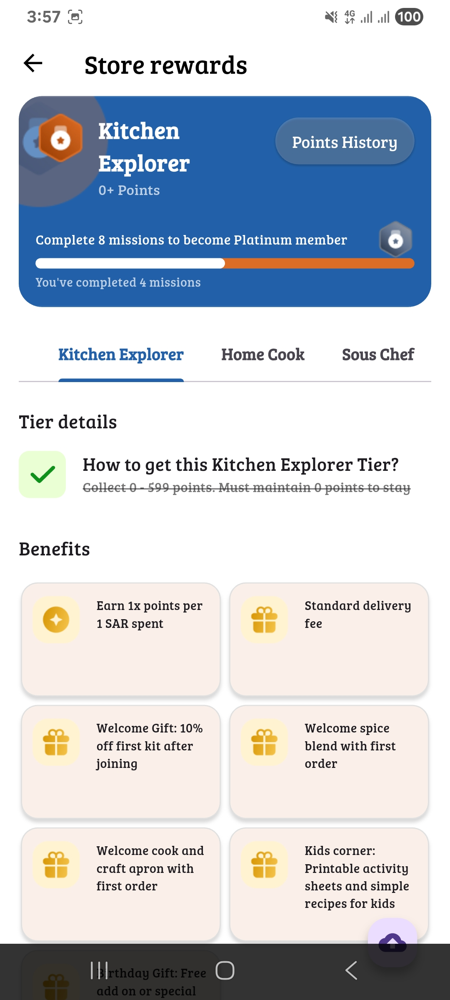

### 6.6 Contact Us
- **Route:** `/contactUs`
- **How to Access:** Navigate from Profile → Help Support Menu → Contact Us

### 6.7 Lifestyle
- **Route:** `/lifestyle`
- **How to Access:** Navigate from Profile → Settings → Lifestyle preferences

### 6.8 About App
- **Route:** `/aboutAppRoute`
- **How to Access:** Navigate from Profile → Help Support Menu → About App

---

## 7. Profile Submenus

### 7.1 Loyalty Rewards Menu
- **Route:** `/loyaltyRewardsMenu`
- **How to Access:** Navigate from Profile → Tap "Loyalty Rewards" menu item
- **Screenshot:** 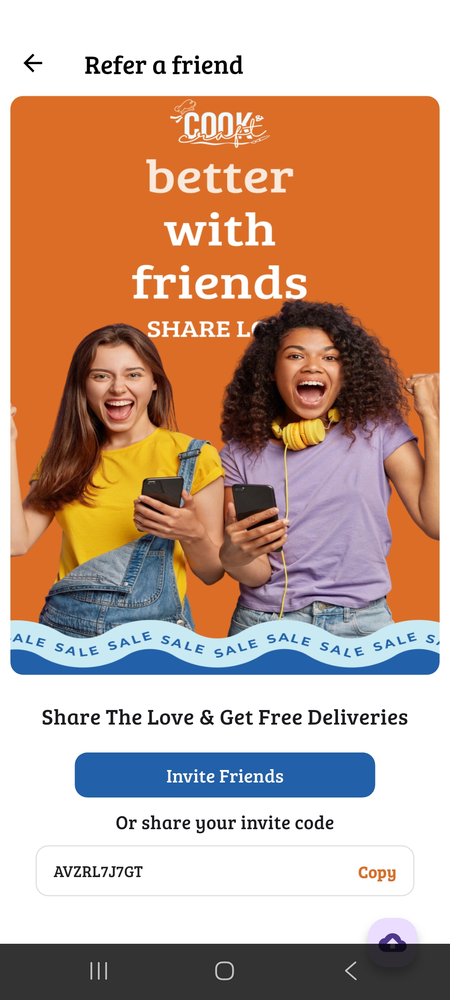

### 7.2 All Redemptions
- **Route:** `/allRedeemedsScreen`
- **How to Access:** Navigate from Profile → Loyalty Rewards Menu → All Redemptions

### 7.3 Delivery Settings Menu
- **Route:** `/deliverySettingsMenu`
- **How to Access:** Navigate from Profile → Tap "Delivery Settings" menu item

### 7.4 Help Support Menu
- **Route:** `/helpSupportMenu`
- **How to Access:** Navigate from Profile → Tap "Help & Support" menu item

### 7.5 Meals Plan Subscription Menu
- **Route:** `/mealsPlanSubscriptionMenu`
- **How to Access:** Navigate from Profile → Tap "Meals Plan Subscription" menu item

### 7.6 Notification Settings Menu
- **Route:** `/notificationSettingsMenu`
- **How to Access:** Navigate from Profile → Settings → Notification Settings

---

## 8. Payment & Checkout

### 8.1 Checkout
- **Route:** `/checkout`
- **How to Access:** Navigate from Cart Orders screen → Tap "Proceed to Checkout" button
- **Screenshot:** 
- **Screenshot:** 

### 8.2 Add New Payment Method
- **Route:** `/addNewPaymentMethod`
- **How to Access:** Navigate from Checkout screen → Tap "Add Payment Method", or Profile → Payment Methods → Add New

### 8.3 Payment Authentication
- **Route:** `/paymentAuthentication`
- **How to Access:** Automatically shown during checkout when payment requires authentication (3D Secure, biometric, etc.)

---

## 9. Orders

### 9.1 Orders History
- **Route:** `/ordersHistory`
- **How to Access:** Navigate from Profile → Orders History, or Market screen → Past Orders
- **Screenshot:** 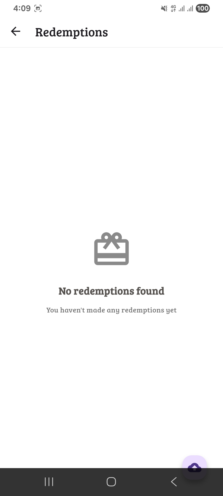
- **Screenshot:** 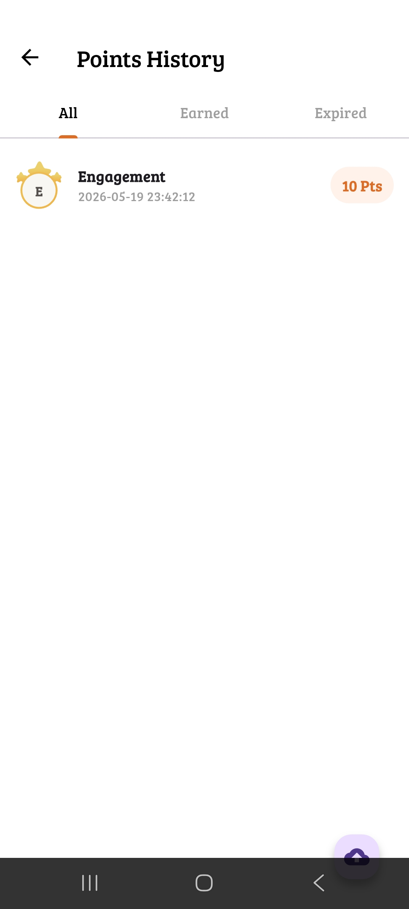

---

## 10. Legal & Support

### 10.1 Privacy Policy
- **Route:** `/privacy`
- **How to Access:** Navigate from Profile → Help Support Menu → Privacy Policy, or from signup/login screens

### 10.2 Terms of Service
- **Route:** `/terms`
- **How to Access:** Navigate from Profile → Help Support Menu → Terms of Service, or from signup/login screens

### 10.3 FAQ
- **Route:** `/faq`
- **How to Access:** Navigate from Profile → Help Support Menu → FAQ

### 10.4 Coming Soon
- **Route:** `/comingSoon`
- **How to Access:** Shown when accessing features that are not yet available or under development

---

## 11. Guest User Screens

*Note: Guest users can access limited features. Schedule, Community, and Profile tabs are locked for guests.*

### 11.1 Guest Schedule View
- **Screen:** Schedule Guest Screen (shown when guest tries to access Schedule tab)
- **How to Access:** As guest user, tap the "Schedule" tab → Shows sign-in prompt

### 11.2 Guest Market Screen
- **Screen:** Guest Market Screen (read-only view of market products)
- **How to Access:** As guest user, tap the "Market" tab (third tab) in bottom navigation bar

### 11.3 Guest Explore Screen
- **Screen:** Explore Screen (accessible to guests)
- **How to Access:** As guest user, tap the "Explore" tab (second tab) in bottom navigation bar

### 11.4 Guest Market Box Details
- **Screen:** Market Box Details (read-only view for guests)
- **How to Access:** As guest user, tap on any product/box from Market screen (cannot add to cart)

### 11.5 Guest Recipes View
- **Screen:** Recipes Screen (read-only view for guests)
- **How to Access:** As guest user, navigate from Explore tab → Browse recipes (read-only, cannot submit)

### 11.6 Guest Recipe Details
- **Screen:** Recipe Details (accessible to guests)
- **How to Access:** As guest user, tap on any recipe card from Recipes screen

### 11.7 Guest Recipe Steps
- **Screen:** Recipe Steps (accessible to guests)
- **How to Access:** As guest user, tap "View Steps" from Recipe Details screen

### 11.8 Guest Recipes By Tags
- **Screen:** Recipes By Tags (accessible to guests)
- **How to Access:** As guest user, tap on any recipe tag/category from Recipes screen

### 11.9 Guest Posts View
- **Screen:** Posts Screen (read-only view for guests, cannot create posts)
- **How to Access:** As guest user, navigate from Explore tab → View posts (read-only, no create button)

### 11.10 Guest Profile View
- **Screen:** Profile Screen (shows sign-in prompt for guests)
- **How to Access:** As guest user, tap the "Profile" tab → Shows sign-in prompt instead of profile

---

## Notes

- **Location:** This sitemap and all screenshots are located in `documentation/sitemap/` folder
- All screenshots should be placed in the `screenshots/` directory (relative to this file)
- Screenshot naming convention: Sequential numbers and variations (e.g., `01.jpg`, `5.jpg`, `14.1.jpg`, `15.1.jpg`, `040.jpg`, `74.jpg` through `104.jpg`)
- Guest users have limited access: they can browse Explore and Market tabs, view recipes and posts (read-only), but cannot access Schedule, Community, Profile tabs, or make purchases
- Update this document as new screens are added to the app
- Route paths can be found in `lib/config/route/route_manager.dart`

---

## Quick Reference: Route Paths

```
/                           - Splash Screen
/onBoarding                 - Onboarding
/login                      - Login
/signUpForm                 - Sign Up Form
/signupWithGoogle           - Sign Up with Google
/signupWithApple            - Sign Up with Apple
/emailVerification          - Email Verification
/phoneVerification          - Phone Verification
/forgotPassword             - Forgot Password
/resetPassword              - Reset Password
/updateUserPhoneNumber      - Update Phone Number
/tabs                       - Main Tabs (Schedule, Explore, Market, Community, Profile)
/mealPlanForm               - Meal Plan Form
/mealSelection              - Meal Selection
/selectFromMenu             - Select From Menu
/schedules                  - Schedule Screen
/dailyMeals                 - Daily Meals
/weekMenu                   - Week Menu
/pastOrders                 - Past Orders
/mealPreferences            - Meal Preferences
/resumeSubscriptionCheckout - Resume Subscription Checkout
/allSubscriptionIntervallRoute - All Subscription Interval
/marketBoxDetails           - Market Box Details
/exploreOurBoxScreen        - Explore Our Box
/shoppingCard               - Cart Orders
/addons                     - Addons
/orderSummary               - Order Summary
/recipes                    - Recipes
/recipeDetailsRoute         - Recipe Details
/recipeStepsRoute           - Recipe Steps
/recipesByTags              - Recipes By Tags
/submitRecipe               - Submit Recipe
/posts                      - Posts
/createPost                 - Create Post
/polls                      - Polls
/announcements              - Announcements
/wallets                    - Wallets
/storeRewards               - Store Rewards
/tierDetails                - Tier Details
/offersAndDiscounts         - Offers and Discounts
/contactUs                  - Contact Us
/lifestyle                  - Lifestyle
/aboutAppRoute              - About App
/loyaltyRewardsMenu         - Loyalty Rewards Menu
/allRedeemedsScreen         - All Redemptions
/deliverySettingsMenu       - Delivery Settings Menu
/helpSupportMenu            - Help Support Menu
/mealsPlanSubscriptionMenu  - Meals Plan Subscription Menu
/notificationSettingsMenu   - Notification Settings Menu
/checkout                   - Checkout
/addNewPaymentMethod        - Add New Payment Method
/paymentAuthentication      - Payment Authentication
/ordersHistory              - Orders History
/privacy                    - Privacy Policy
/terms                      - Terms of Service
/faq                        - FAQ
/comingSoon                 - Coming Soon
```

